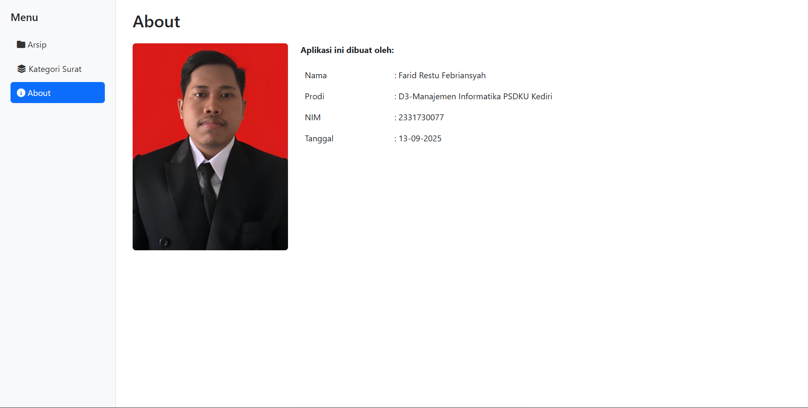

# 📂 Aplikasi Arsip Surat

## 🎯 Tujuan Aplikasi
1. **Mengarsipkan dan mengelola surat**
   - Mengunggah file surat dalam format PDF.  
   - Menyimpan data surat seperti nomor surat, judul, kategori, dan waktu pengarsipan.  
   - Menambahkan dan mengelola kategori surat.  

2. **Mencari dan melihat arsip surat**
   - Mencari surat berdasarkan judul.  
   - Melihat detail surat, termasuk file PDF-nya.  

3. **Mengelola data surat**
   - Mengunduh file surat yang sudah diunggah.  
   - Menghapus data surat dari sistem.  

4. **Informasi tentang pembuat aplikasi**
   - Halaman **About** berisi nama, NIM, foto, dan tanggal pembuatan aplikasi.  

---

## ✨ Fitur Aplikasi
- Menampilkan data tabel arsip surat.  

- Mencari surat berdasarkan judulnya.
  
- Menghapus salah satu data surat.
  
- Mengunduh file PDF yang sudah diupload.
  
- Melihat detail salah satu data surat.
  
- Halaman untuk menambahkan data arsip surat.
  
- Menampilkan halaman data kategori surat.
  
- Mencari kategori berdasarkan nama kategori.
  
- Halaman untuk update/mengubah data kategori.
  
- Menghapus salah satu data kategori.
  
- Halaman untuk menambahkan data kategori.
  
- Halaman untuk menampilkan data pembuat project ini.  


---

## 🚀 Cara Menjalankan Aplikasi

### 1. Persiapan Awal
- Install **XAMPP / Laragon / WAMP** (Pastikan Apache dan MySQL aktif).  
- Pindahkan folder proyek ke direktori server lokal, misalnya:  
C:\xampp\htdocs\nama_aplikasi

### 2. Konfigurasi Database
- Buka **phpMyAdmin** melalui browser: [http://localhost/phpmyadmin/](http://localhost/phpmyadmin/)  
- Buat database baru dengan nama yang sesuai.  
- Import file `lsp-polinema.sql` yang ada di folder **SQL**.  

### 3. Instalasi & Konfigurasi
Buka terminal / Git Bash, lalu masuk ke folder proyek:
```bash
cd nama_aplikasi
Untuk menjalankannya menggunakan **php artisan serve**
